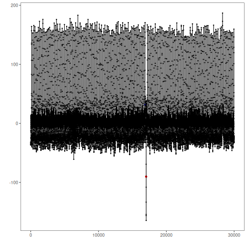

Real data from human medicine, biology, meteorology and industry

* Selection with ECG data series
* Univariate series with labeled anomalies
* Recommended use: univariate anomaly detection

Source: https://paperswithcode.com/dataset/ucr-anomaly-archive


## Load series

``` r
library(united)
library(daltoolbox)
library(daltoolboxdp)
library(harbinger)
library(tspredit)
```

Selecting a well as example

``` r
## Load series ----------------------
data(ucr_ecg)
```


``` r
#Selecting series
series <- ucr_ecg[[3]]
plot(as.ts(series$value))
```


## Event detection experiment

Detection steps

``` r
#Establishing arima method
#model <- hanr_arima()
model <- han_autoencoder(3, 2, autoenc_ed, num_epochs = 1500)
```


``` r
#Fitting the model
train <- series[1:5000,] #Using a train sample subset
model <- fit(model, train$value)
```


``` r
#Making detections
detection <- detect(model, series$value)
```


## Results analysis


``` r
#Filtering detected events
print(detection |> dplyr::filter(event==TRUE))
```

```
##     idx event    type
## 1 17024  TRUE anomaly
```

Visual analysis

``` r
#Ploting the results
grf <- har_plot(model, series$value, detection, series$event)
plot(grf)
```



Evaluate metrics

``` r
#Evaluating the detection metrics
ev <- evaluate(model, detection$event, series$event)
print(ev$confMatrix)
```

```
##           event      
## detection TRUE  FALSE
## TRUE      0     1    
## FALSE     1     29998
```


``` r
#SoftEd Evaluation
ev_soft <- evaluate(har_eval_soft(sw=200), detection$event, series$event)
print(ev_soft$confMatrix)
```

```
##           event         
## detection TRUE  FALSE   
## TRUE      0.38  0.62    
## FALSE     0.62  29998.38
```

``` r
print(ev_soft$accuracy)
```

```
## [1] 0.9999587
```

``` r
print(ev_soft$F1)
```

```
## [1] 0.38
```

